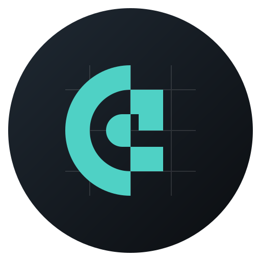
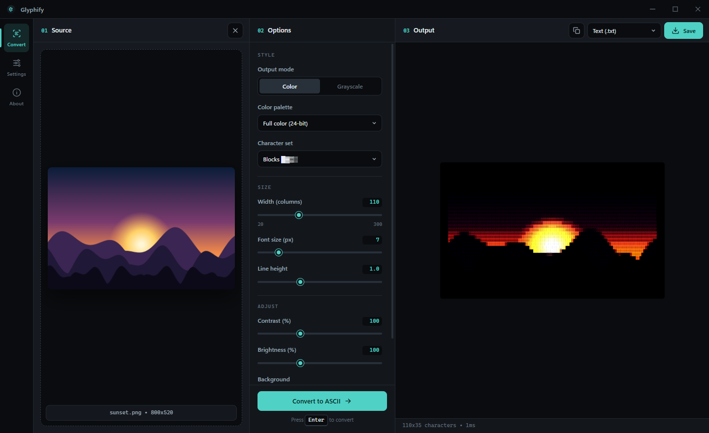

<p align="center">
  
</p>

<h1 align="center">Glyphify</h1>

<p align="center">
  A desktop app for turning images, GIFs and video into ASCII art.
</p>

<p align="center">
  <a href="https://github.com/KillaMeep/Glyphify/releases/latest"></a>
  <a href="https://github.com/KillaMeep/Glyphify/actions/workflows/build-and-release.yml"></a>
  
  <a href="LICENSE"></a>
</p>

<p align="center">
  
</p>

## Download

| Platform | Package | Link |
| --- | --- | --- |
| Windows (x64) | NSIS installer | [Glyphify.exe](https://github.com/KillaMeep/Glyphify/releases/latest/download/Glyphify.exe) |
| Linux (x64) | AppImage | [Glyphify.AppImage](https://github.com/KillaMeep/Glyphify/releases/latest/download/Glyphify.AppImage) |

Both links download the newest release directly. On Linux, mark the AppImage as executable before running it:

```bash
chmod +x Glyphify.AppImage
./Glyphify.AppImage
```

macOS builds are not published yet. You can run Glyphify on macOS from source (see [Building from source](#building-from-source)).

Glyphify checks GitHub for newer releases and lets you know when one is available. You can also check manually from **Settings → Check for updates**.

## Features

- **Image input:** PNG, JPG, GIF, WebP and BMP.
- **Video input:** MP4 and WebM play natively. Other containers such as MOV and AVI are decoded through the bundled FFmpeg.
- **Seven character sets:** Standard, Detailed (70 characters), Block elements, Simple, Binary, Braille, and your own custom ramp.
- **Color output:** 24-bit color or grayscale, with optional palette reduction to ANSI 256, ANSI 16, CGA or Game Boy.
- **Adjustments:** output width, font size, line height, contrast, brightness, character inversion and background color, with a live preview.
- **Animation:** GIFs and videos are converted frame by frame, at a frame rate you choose.
- **Export:** plain text, standalone HTML, PNG (1× to 4× scale), animated GIF and MP4.
- **Themes:** five dark themes (Graphite, Obsidian, Midnight, Forest and Amethyst) and a choice of monospace output fonts.

## Usage

1. Drag a file onto the **Source** panel, or click **Browse files** (<kbd>Ctrl</kbd>+<kbd>O</kbd>).
2. Adjust the style, size and tone in the **Options** panel. With live preview on, the output updates as you go.
3. Click **Convert to ASCII** or press <kbd>Enter</kbd>.
4. Choose a format in the **Output** panel and click **Save** (<kbd>Ctrl</kbd>+<kbd>S</kbd>), or copy the text to the clipboard.

### Keyboard shortcuts

| Shortcut | Action |
| --- | --- |
| <kbd>Ctrl</kbd>+<kbd>O</kbd> | Open a file |
| <kbd>Enter</kbd> | Convert |
| <kbd>Ctrl</kbd>+<kbd>C</kbd> | Copy the output as plain text |
| <kbd>Ctrl</kbd>+<kbd>S</kbd> | Save the output |
| <kbd>Esc</kbd> | Clear the current input |

### Export formats

| Format | Use it for |
| --- | --- |
| Text (`.txt`) | Terminals, code comments, chat. Carries no color. |
| HTML (`.html`) | A self-contained page that keeps per-character color. |
| Image (`.png`) | A rendered snapshot, scaled 1× to 4× (set in Settings). |
| Animated GIF | Animated output from GIF or video input. |
| Video (`.mp4`) | Longer animations, encoded with FFmpeg. |

## Building from source

### Prerequisites

- [Node.js](https://nodejs.org/) 24 or later (the version CI uses)
- npm
- Git

### Run in development

```bash
git clone https://github.com/KillaMeep/Glyphify.git
cd Glyphify
npm install
npm start
```

To open Chromium DevTools alongside the app, run:

```bash
npm start -- --dev
```

### Package an installer

Packaging uses [electron-builder](https://www.electron.build/) and writes to `dist/`.

```bash
npm run build:win     # Windows NSIS installer
npm run build:linux   # Linux AppImage
npm run build         # Default target for the current OS
```

Build each target on its own operating system, as CI does.

## Project structure

```text
src/
├── main.js                  Electron main process: window, dialogs, file I/O, FFmpeg encoding
├── preload.js               Safe IPC bridge exposed to the renderer as window.electronAPI
├── update-checker.js        Checks GitHub Releases for newer versions
└── renderer/
    ├── index.html           Application UI
    ├── styles.css           Theme tokens and component styles
    ├── renderer.js          UI state, settings and the conversion pipeline
    ├── ascii-converter.js   Pixel-to-character mapping, color palettes, HTML/PNG output
    └── *-worker.js          Web workers for frame extraction and GIF/video encoding
assets/                      App icons and logo
```

## Releases

Every push to `main` that touches the application source runs the [Build and Release](.github/workflows/build-and-release.yml) workflow. It builds the Windows installer and the Linux AppImage and publishes them as a GitHub release numbered `v0.0.<run>`. Only the three most recent releases are kept.

You can also run the workflow manually. The optional `tag` input (for example `v1.2.0`) sets the version embedded in the built app.

## Contributing

Bug reports and pull requests are welcome. Before opening a pull request:

1. Run the app with `npm start` and exercise the part you changed, with both image and video input if relevant.
2. Keep changes focused. Put UI styling in `styles.css` using the existing theme tokens rather than hard-coded colors.
3. Describe what changed and how you tested it.

## License

Released under the [MIT License](LICENSE).
